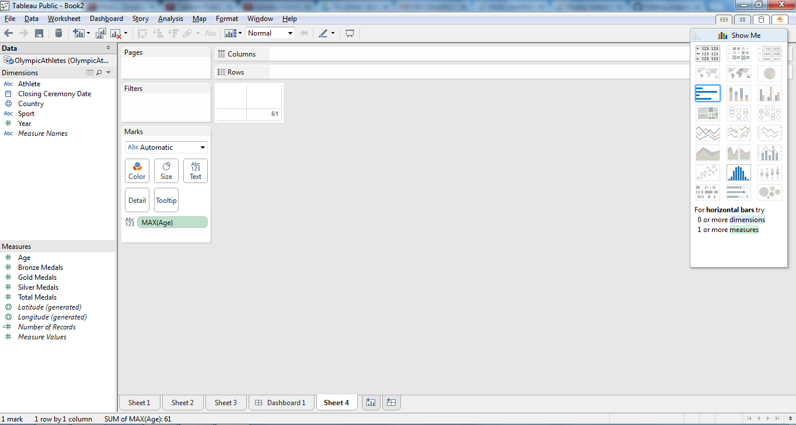
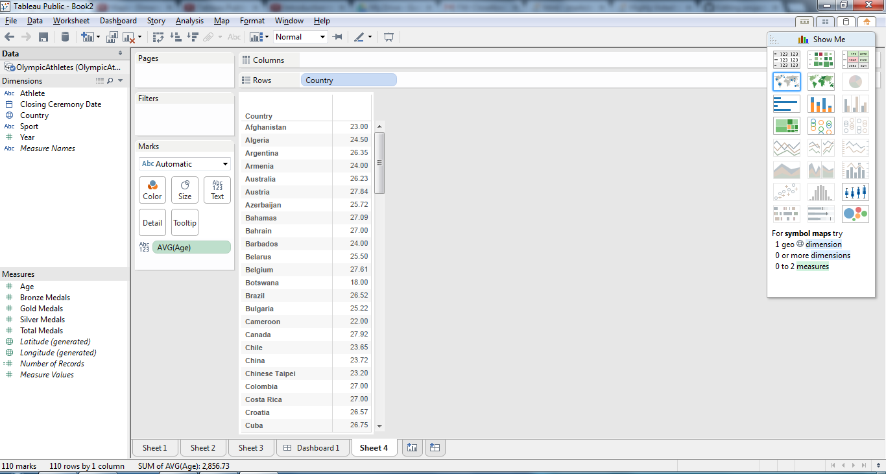
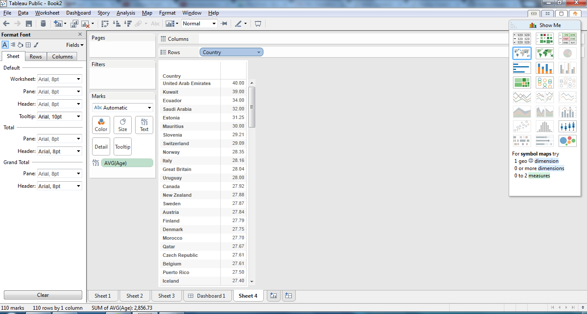
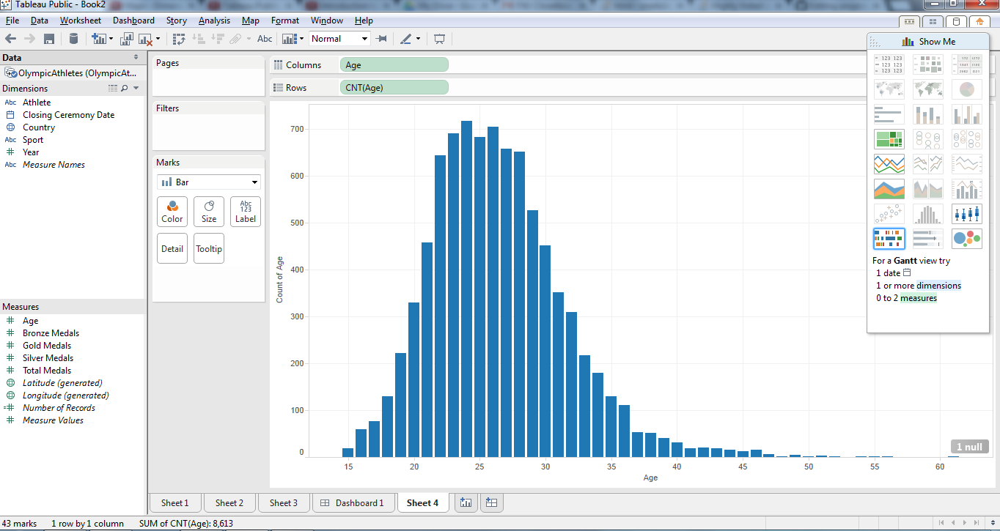
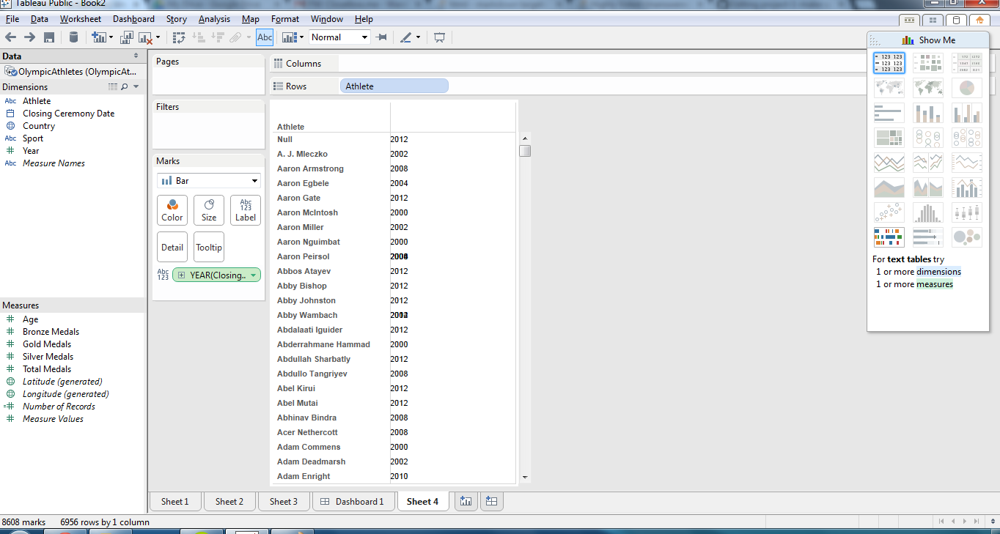
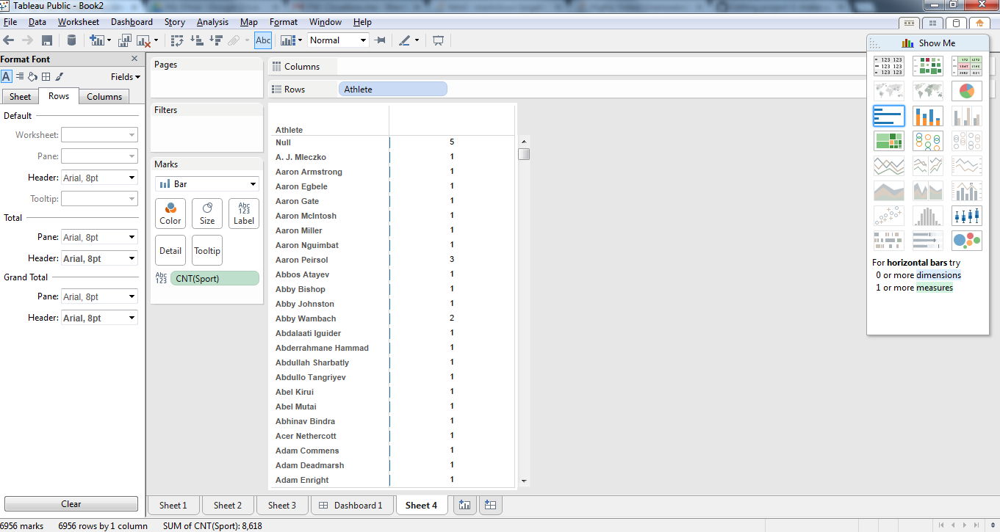
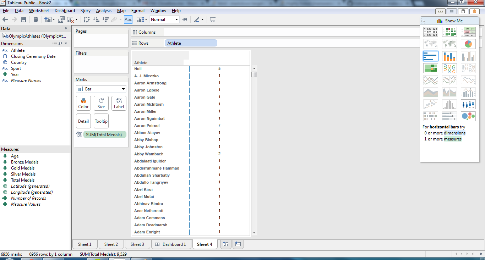
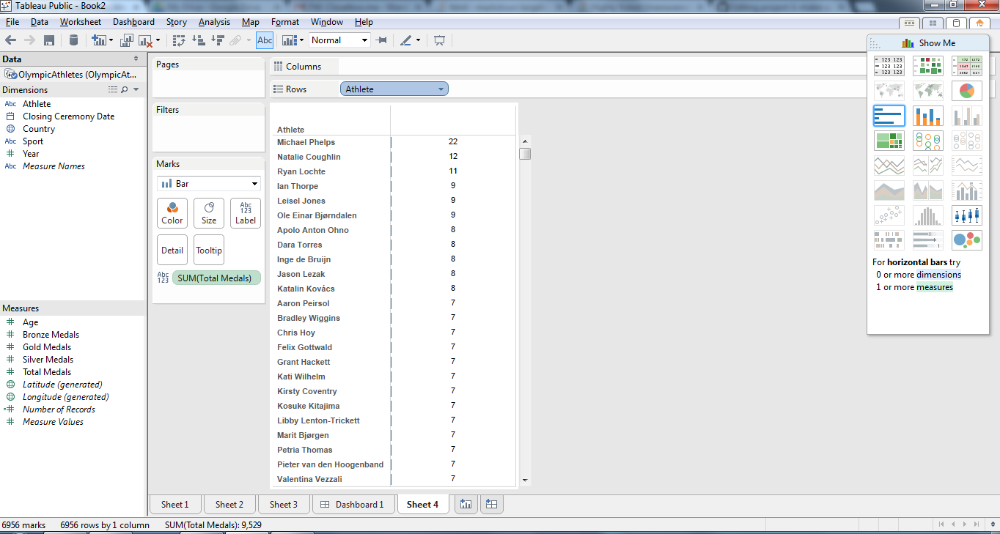
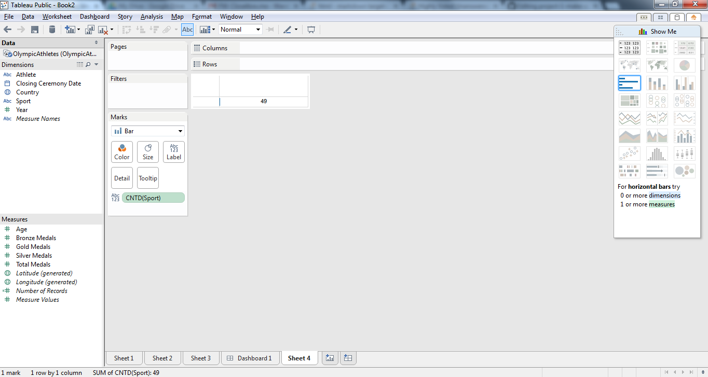

# Name

Ryan Roden

# How many points have you earned?

70/100

(Make your own calculation and replace the number 0 with the points you think you've earned.)

# How many hours have you spent on this?

4 hours

# What is the most difficult part about this week's challenge?

fill-in-your-answer

# Show and tell (8 points)

## Link (2 points)

[title-of-the-article](http://link-to-an-interesting-visualization-involving-a-map)

## What new knowledge or insight have you gained from this visualization? (6 points)

fill-in-your-answer

# Tableau (I) (7 points x 3 + 2 points x 10 + 3 points x 10 = 71 points)

## Checkpoints

### 1 (7 points)

### 2 (7 points)

### 3 (7 points)

## Challenges

### 1 (2 points)

### 2 (2 points)

### 3 (2 points)

### 4 (2 points)

### 5 (2 points)

### 6 (2 points)

### 7 (2 points)

### 8 (2 points)

### 9 (2 points)

### 10 (2 points)

### 11 (3 points)

### 12 (3 points)

### 13 (3 points)

### 14 (3 points)

### 15 (3 points)

### 16 (3 points)

### 17 (3 points)

### 18 (3 points)

### 19 (6 points)

# Analysis 1

## Checkpoints (7 points x 3 = 21 points)

### 1 (7 points)

### 2 (7 points)

### 3 (7 points)

