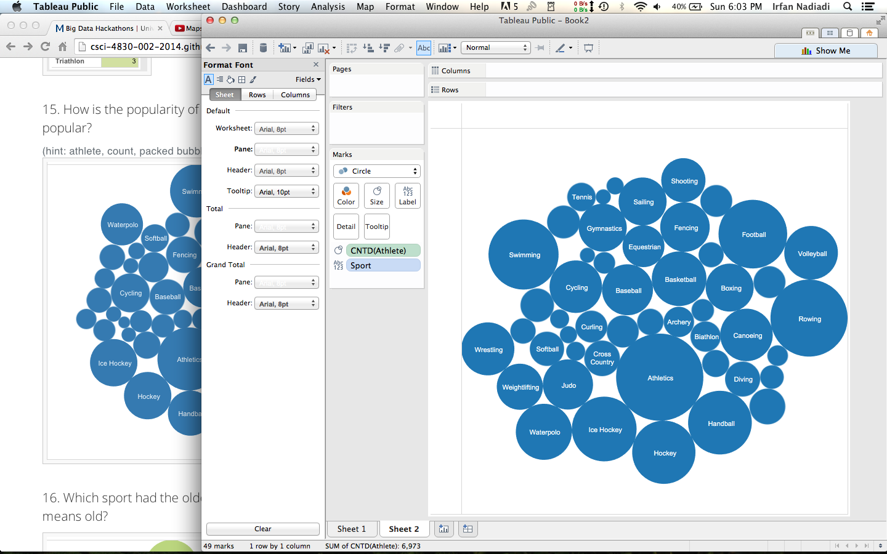

# Name

Irfan Nadiadi

# How many points have you earned?

86/100

- I couldn't complete the last two checkpoints

# How many hours have you spent on this?

4

# What is the most difficult part about this week's challenge?

I wasn't able to figure out why Gauss wouldn't operate on the data I read in and the d3 dependency wouldn't install for i.js, so I wasn't able to get that working either.

# Show and tell (8 points)

## Link (2 points)

[How Students Listen](http://static.echonest.com/HowStudentsListen/)

[Specific Link to CU Boulder](http://static.echonest.com/HowStudentsListen/school.html?school=university%20colorado%20boulder)

## What new knowledge or insight have you gained from this visualization? (6 points)

Spotify, a music streaming application, collected data on the music listened to by students around the country and used it to characterize listening habits for multiple universities. The map aspect isn't integral to the visualization, but it is cool to see how music interests vary across the country. CU Boulder, for example, really doesn't enjoy Beyonce, we're the top university that listens to Skrillex as well as Jazz, and we sleep early and wake early.

# Tableau (I) (7 points x 3 + 2 points x 10 + 3 points x 10 = 71 points)

## Checkpoints

### 1 (7 points)

### 2 (7 points)

### 3 (7 points)

## Challenges

### 1 (2 points)

### 2 (2 points)

### 3 (2 points)

### 4 (2 points)

### 5 (2 points)

### 6 (2 points)

### 7 (2 points)

### 8 (2 points)

### 9 (2 points)

### 10 (2 points)

### 11 (3 points)

### 12 (3 points)

### 13 (3 points)

### 14 (3 points)

### 15 (3 points)

### 16 (3 points)

### 17 (3 points)

### 18 (3 points)

### 19 (6 points)

# Analysis 1

## Checkpoints (7 points x 3 = 21 points)

### 1 (7 points)

### 2 (7 points)
I copied the age data into a text file and was able to successfully read it in, but calling any methods kept returning NaN and I'm not sure what I was doing wrong.

### 3 (7 points)
While I was able to use node to run i.js on port 3000, every time I ran %init_d3, the server would crash. I believe this is because for some reason (that's beyond me right now), I can't install the d3 dependency.

Here's a screenshot of the terminal after running %init_d3

